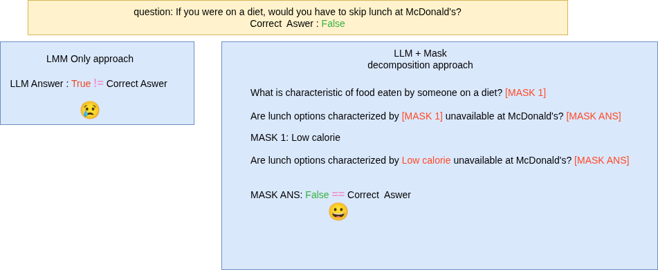
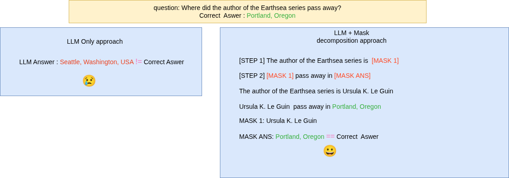
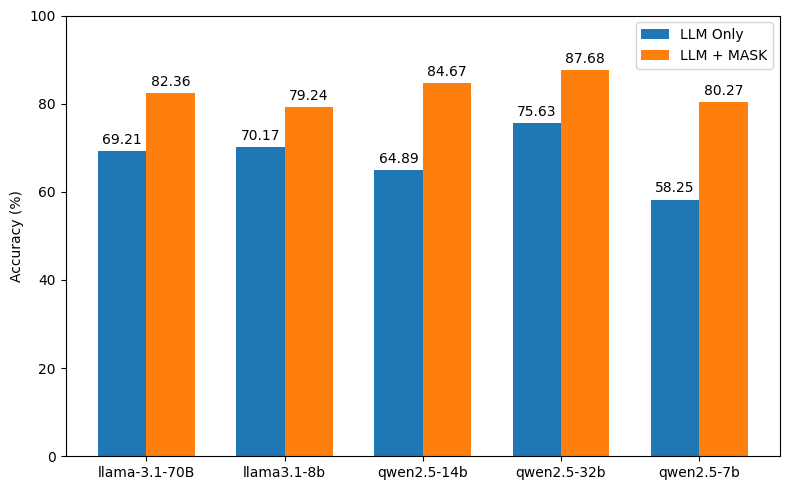
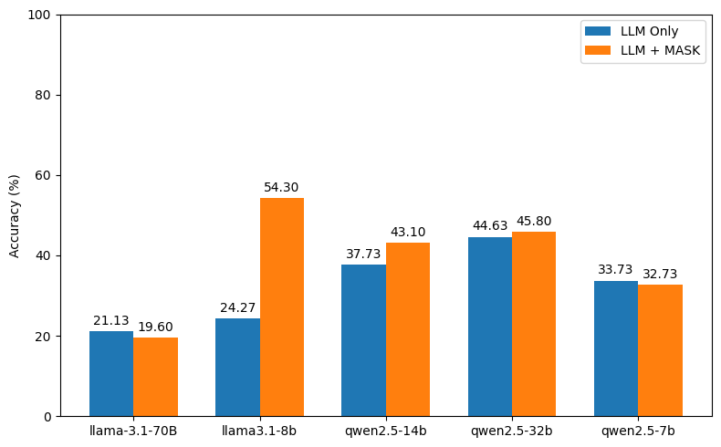

Paper link: Coming soon. 
# LLM Reasoning Experiments

This repository contains experiments comparing LLM strategies on different datasets.

---
## Example: LLM-only vs LLM + MASK reasoning (StrategyQA)


By decomposing the question, the model identifies the correct answer.

## Example: LLM-only vs LLM + MASK reasoning (MQuAKE-CF-3k-v2)


By decomposing the question, the model identifies the correct answer.


LLM + MASK solves complex questions by decomposing them into sub-questions, producing correct step-by-step reasoning.
## Model Results

### StrategyQA

Accuracy Comparison: LLM only vs LLM + MASK  



### MQuAKE-CF-3k-v2

Accuracy Comparison: LLM only vs LLM + MASK  


## Reproducing the Results

Follow these steps to reproduce the results:

```bash
# Clone the repository
git clone https://github.com/jaaferklila/llmreasoning.git
cd llm-reasonin

# 1️Create the Conda environment
conda create -n llmreasoning python=3.10
conda activate llmreasoning
pip install -r requirements.txt
```
# 2️ Run the experiments
For the LLM only run:
```bash
python LLM_Only.py --model_name <model_name> --dataset_name <dataset_name>
```

Example:
For the StrategyQA dataset with the LLaMA model:
```bash
python LLM_Only.py --model_name llama3.1-8b --dataset_name strategyqa
```

Results:

Printed in the terminal

Saved into a folder called output/
